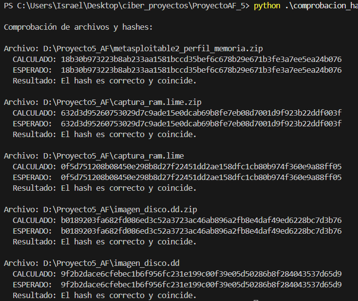
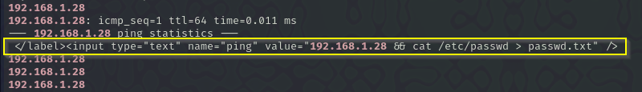
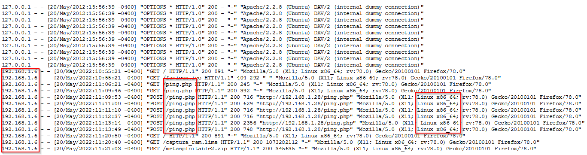
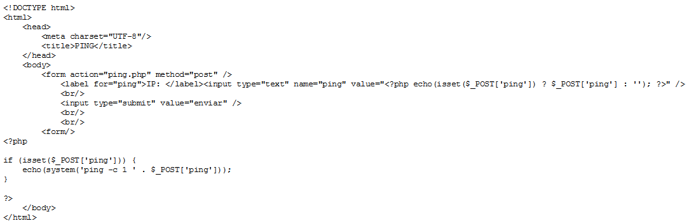
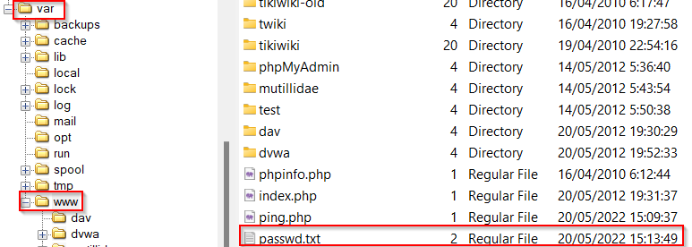
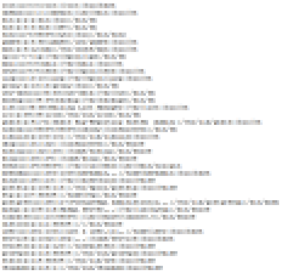

# Anexo Incident on Linux Server I - Israel Valderrama García

## Declaración de abstención y tacha

Yo, Israel Valderrama García, identificado con documento 0111234-C, en mi condición de perito informático, declaro formalmente lo siguiente:

### 1. Abstención

No mantengo ningún interés personal, profesional o económico en el objeto del presente informe ni con las partes involucradas, garantizando así mi total imparcialidad, conforme a lo establecido en la normativa ISO-27000 y las leyes aplicables.

### 2. Tacha

No existen motivos de recusación que afecten mi idoneidad como perito, ya que no tengo vínculos familiares, laborales, comerciales o de cualquier otra naturaleza con las partes, ni he intervenido previamente en el caso de manera que comprometa mi neutralidad.

### 3. Confirmación de imparcialidad

El presente informe se sustenta en:

- Análisis técnico objetivo de las evidencias digitales.

- Metodología forense reconocida y aceptada en el ámbito pericial.

- Ausencia de influencia externa en la elaboración de mis conclusiones.

Asumo la responsabilidad de actuar con rigor profesional, independencia y transparencia en la emisión de este dictamen pericial.

## Juramento de promesa

Yo, Israel Valderrama García, identificado con DNI 0111234-C, en mi calidad de Perito Informático Colegiado, bajo juramento y conforme a la normativa vigente, declaro solemnemente:

### 1. Principios de actuación

Me comprometo a realizar el análisis técnico del presente caso con estricto apego a la objetividad, veracidad y rigor científico, siguiendo los estándares reconocidos en informática forense y el marco legal aplicable.

### 2. Sustentación de las conclusiones

Garantizo que todas las conclusiones del informe se basarán exclusivamente en evidencias digitales verificables, utilizando metodologías validadas y documentando cada fase del proceso para garantizar su reproducibilidad y transparencia.

### 3. Independencia e imparcialidad

Actuaré con total independencia, libre de influencias externas, intereses personales o presiones que puedan comprometer mi neutralidad, conforme al artículo 335.2 de la LEC y los códigos deontológicos de la profesión.

### 4. Cumplimiento normativo y ético

Aseguro el respeto a las normas legales, de confidencialidad y protección de datos, así como la preservación de la cadena de custodia de las pruebas, evitando alteraciones o manipulaciones.

**Ratificación del compromiso**
Reafirmo, bajo juramento, mi deber de actuar con integridad profesional y asumir las responsabilidades legales derivadas de este dictamen.  
En Cádiz a 26 de Marzo de 2025  
Fdo:

## Figuras

### Figura 1 - Calculo de hash

### Figura 2 - Memoria RAM

## Hallazgo

### Hallazgo 1

| Ruta                  | `/var/log/apache2/access.log`                                    |
|-----------------------|------------------------------------------------------------------|
| Contenido del fichero |                                |
| MAC                   | 20/05/2022 15:21:03                                              |
| HASH 256              | 03fc3dec1392a16c17dc00bd7de982e7a4465a4ca5a3e4e04d6d0bec3241fa4c |

### Hallazgo 2

| Ruta                  | `/var/www/ping.php`                                              |
|-----------------------|------------------------------------------------------------------|
| Contenido del fichero |                                |
| MAC                   | 20/05/2022 15:09:37                                              |
| HASH 256              | 3d3befe46220f2915bf3a32ee03ea71ab5ddbb13d4c048d78d1bfdca889e192b |

### Hallazgo 3

| Ruta                  | `/var/www/passwd.txt`                                                 |
|-----------------------|-----------------------------------------------------------------------|
| Contenido del fichero |   |
| MAC                   | 20/05/2022 15:13:49                                                   |
| HASH 256              | bd48fa58f2995305249ed3b8b8161034228e9f6e2753a8e324430a7f194b47ac      |

