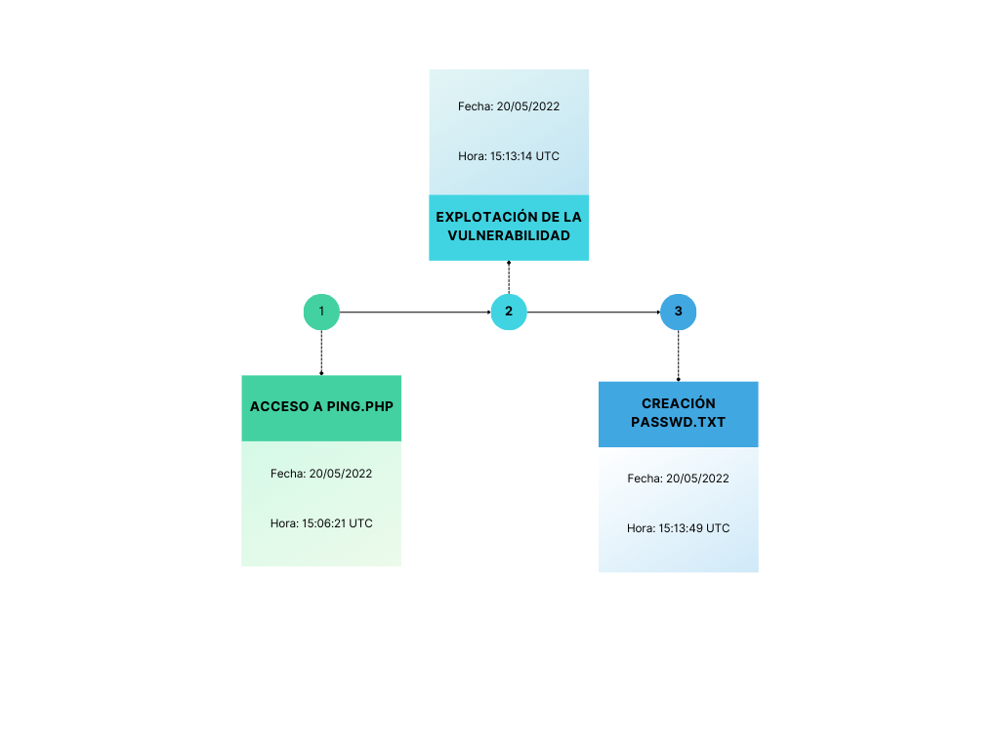

# Proroyecto 5: Incident on Linux Server I

**Código:** P05
**Nombre:** Incident on Linux Server
**Analista forense:** Israel Valderrama García
**Fecha:** 25/03/2025

## Índice

1. [Resumen Ejecutivo](#resumen-ejecutivo)
2. [Glosario de términos](#glosario-de-términos)
3. [Introducción](#introducción)
    1. [Datos del equipo](#datos-del-equipo)
    2. [Antecedentes](#antecedentes)
    3. [Objetivos](#objetivos)
    4. [Verificación](#verificación)
4. [Fuente de información](#fuente-de-información)
    1. [Cadena de custodia](#cadena-de-custodia)
5. [Análisis](#análisis)
    1. [Metodología](#metodología)
6. [Procesos](#procesos)
    1. [Herramientas utilizadas](#herramientas-utilizadas)
    2. [Identificación de la vulnerabilidad](#identificación-de-la-vulnerabilidad)
    3. [Identificación del atacante](#identificación-del-atacante)
    4. [Datos exfiltrados](#datos-exfiltrados)
    5. [Registros del archivo original](#registros-del-archivo-original)
    6. [Hallazgos clave](#hallazgos-clave)
    7. [Interpretación del ataque](#interpretación-del-ataque)
    8. [Línea del tiempo](#línea-del-tiempo)
7. [Conclusión](#conclusión)
8. [Anexos](#anexos)

## Resumen Ejecutivo

Este informe presenta los resultados de la investigación sobre un incidente de seguridad ocurrido en un servidor Linux, en el que se detectó la exfiltración de datos sensibles. El análisis forense realizado se centró en identificar la vulnerabilidad explotada por el atacante, determinar los detalles del ataque, incluyendo la IP, el cliente y el sistema operativo utilizados, así como los datos comprometidos. A través de una revisión exhaustiva de los logs y otros registros relevantes, se identificaron las actividades del atacante. Finalmente, se proponen medidas correctivas para mitigar futuras amenazas y fortalecer la seguridad del servidor comprometido.

## Glosario de términos

- Cross-Site Scripting (XSS): Técnica de ataque en la que un atacante inserta scripts maliciosos en páginas web vistas por otros usuarios, con el fin de robar información o manipular el contenido de la página.

- Hash: Algoritmo matemático que convierte datos de longitud variable en una cadena de longitud fija. Se usa para almacenar contraseñas o verificar la integridad de los datos.

- Memoria RAM: Memoria de acceso aleatorio utilizada por los dispositivos para almacenar datos temporales y las instrucciones que están siendo procesadas por el sistema operativo y las aplicaciones.

- Payload: Código malicioso diseñado para ser ejecutado después de que se explota una vulnerabilidad en el sistema. Puede realizar diversas acciones, como robar datos, dañar archivos o tomar control del sistema.

- Sanitización de Entrada: Proceso de limpiar y filtrar las entradas de datos proporcionadas por el usuario para evitar la ejecución de código malicioso, como inyecciones SQL o XSS.

- Apache: Servidor web de código abierto ampliamente utilizado para gestionar solicitudes HTTP, alojar sitios web y servir contenido a los usuarios a través de la red.

## Introducción

Durante una revisión rutinaria de seguridad, se detectó una posible brecha en un servidor web, relacionada con la exfiltración de datos sensibles. Este informe tiene como objetivo investigar el incidente, identificar la vulnerabilidad explotada por el atacante, determinar los detalles del ataque, incluyendo la IP, el cliente y el sistema operativo utilizado, así como los datos comprometidos. Finalmente, se presentarán recomendaciones para abordar la vulnerabilidad y evitar futuros incidentes de seguridad.

### Datos del equipo

El perito forense informático especializado en ciberseguridad en entornos de las tecnologías de la información responsable de la redacción de este informe es Israel Valderrama García. Sus datos son los siguientes:

Número de identificación: 0111234-C

Correo electrónico: <ivalgar260@g.educaand.es>

### Antecedentes

Durante una jornada laboral habitual, el silencio en el centro de datos fue interrumpido por una alarma. Un técnico, recibió una notificación sobre un posible incidente de seguridad: la exfiltración de datos sensibles desde un servidor a través de una aplicación web que, a simple vista, parecía segura.

Sin embargo, esa aplicación, diseñada para escanear redes de manera remota, contenía una vulnerabilidad crítica.

### Objetivos

El objetivo principal del análisis forense digital es seguir el rastro dejado por el intruso, identificar su identidad y comprender la motivación detrás del ataque. Para ello, se llevarán a cabo los siguientes objetivos:

- Identificar la vulnerabilidad en la aplicación web que fue explotada por el atacante.

- Determinar la IP, el cliente y el sistema operativo utilizado por el atacante.

- Descubrir qué datos fueron exfiltrados del servidor comprometido.

- Analizar por qué el archivo original no muestra actividad durante el incidente.

- Proponer soluciones para reparar la vulnerabilidad explotada.

### Verificación

En la Figura 1 del Anexo se muestra la verificación de los hashes, los cuales coinciden de manera exacta con los de la imagen del disco, la captura de la memoria RAM y el perfil de la memoria. Esta concordancia asegura la integridad de las evidencias y confirma que los datos obtenidos corresponden de forma precisa a los originales proporcionados.

## Fuente de información

Se nos ha pasado una imagen de disco, captura de la memoria RAM y su perfil, además de un archivo con los hashes de cada evidencia para poder hacer un análisis correcto.

### Cadena de custodia

|              **Sección**                     |                          **Campo**                                       |
|----------------------------------------------|--------------------------------------------------------------------------|
| **1. INFORMACIÓN DEL CASO**                  |                                                                          |
| Número de caso                               | 01                                                                       |
| Tipo de investigación                        | Adquisición de memoria volátil                                           |
| Fecha de Adquisición                         | 13/03/2025 (por parte de otros responsables)                             |
| Lugar de Adquisición                         | C/ Amiel, s/n - 11012, Cádiz (Cádiz)                                     |
| Número de caso                               | 02                                                                       |
| Tipo de investigación                        | Adquisición de memoria no volátil                                        |
| Fecha de Adquisición                         | 13/03/2025 (por parte de otros responsables)                             |
| Lugar de Adquisición                         | C/ Amiel, s/n - 11012, Cádiz (Cádiz)                                     |
| **2. DESCRIPCIÓN EVIDENCIAS EN ORIGINAL**    |                                                                          |
| Tipo de Dispositivo                          | Memoria RAM                                                              |
| Hash de la Evidencia Original                | SHA256: 0f5d751208b08450e298b8d27f22451dd2ae158dfc1cb80b974f360e9a88ff05 |
| Tipo de Dispositivo                          | Disco Duro                                                               |
| Hash de la Evidencia Original                | SHA256: 9f2b2dace6cfebec1b6f956fc231e199c00f39e05d50286b8f284043537d65d9 |
| **3. PRESERVACIÓN DE LA EVIDENCIA ORIGINAL** |                                                                          |
| Fecha de Entrega                             | 13/03/2025                                                               |
| Hora de Entrega                              | 08:00 UTC+1                                                              |
| Recibido por                                 | Manuel Jesús Rivas Sández                                                |
| Ubicación en el Juzgado                      | C/ Amiel, s/n - 11012, Cádiz(Cádiz)                                      |
| **4. CREACIÓN Y VERIFICACIÓN DE COPIAS**     |                                                                          |
| Fecha y Hora de Creación                     | 26/03/2025, 23:45 UTC+1                                                  |
| Técnico Responsable                          | Israel Valderrama García                                                 |
| Hash de la copia de la RAM                   | SHA256: 0f5d751208b08450e298b8d27f22451dd2ae158dfc1cb80b974f360e9a88ff05 |
| Hash de la copia del Disco Duro              | SHA256: 9f2b2dace6cfebec1b6f956fc231e199c00f39e05d50286b8f284043537d65d9 |
| Verificación de la Integridad                | Si                                                                       |
| Entregado a                                  | Manuel Jesús Rivas Sández                                                |
| Fecha y Hora de Entrega                      | 26/03/2025, 23:45 UTC+1                                                  |
| **5. REGISTRO DE ACCESOS Y VERIFICACIONES**  |                                                                          |
| Fecha y Hora                                 | 13/03/2025, 08:00 UTC+1                                                  |
| Propósito                                    | Análisis de evidencias                                                   |
| Hash Verificado RAM                          | SHA256: 0f5d751208b08450e298b8d27f22451dd2ae158dfc1cb80b974f360e9a88ff05 |
| Hash Verificado Disco Duro                   | SHA256: 9f2b2dace6cfebec1b6f956fc231e199c00f39e05d50286b8f284043537d65d9 |
| Coincide con el original                     | Si                                                                       |

## Análisis

El análisis forense realizado tuvo como objetivo identificar las acciones del atacante, determinar la vulnerabilidad explotada y evaluar el impacto del incidente. Para ello, se aplicaron diversas técnicas forenses sobre las evidencias recopiladas.

### Metodología

Para garantizar la precisión y confiabilidad del análisis, se siguió un enfoque estructurado basado en los siguientes pasos:

1. Análisis de la imagen del disco

    - Se examinaron los registros del sistema y los archivos de configuración en busca de actividad sospechosa.

    - Se identificaron logs que revelaban accesos no autorizados y la posible explotación de una vulnerabilidad.

2. Análisis de la memoria RAM

    - Se extrajeron procesos en ejecución y conexiones de red activas al momento del incidente.

    - Se identificaron posibles comandos ejecutados por el atacante y archivos generados en la sesión.

3. Identificación de la vulnerabilidad explotada

    - Se revisaron los archivos del servidor web en busca de código malicioso o puntos débiles en la aplicación.

    - Se determinó que el atacante utilizó una inyección de código para ejecutar comandos arbitrarios en el sistema.

4. Detección de datos exfiltrados

    - Se analizaron archivos creados o modificados durante el ataque.

    - Se identificó la extracción de información del archivo /etc/passwd y su almacenamiento en un archivo externo.

## Procesos

### Herramientas utilizadas

Para la investigación, se emplearon diversas herramientas forenses y de análisis:

- FTK Imager 4.2.0.13: Para examinar la imagen de disco del servidor comprometido.

- strings: Utilizada en un entorno Linux para extraer contenido de la memoria RAM.

- comprobacion_hash.py: Programa desarrollado para calcular y comparar los hashes de las evidencias recopiladas.

### Identificación de la vulnerabilidad

El análisis de los archivos en el servidor web reveló que el ataque se llevó a cabo explotando una vulnerabilidad en el archivo ping.php, ubicado en `/var/www`. Esta vulnerabilidad permitía la ejecución arbitraria de código, lo que facilitó al atacante el acceso no autorizado al sistema.

Los registros del servidor indicaron que el atacante utilizó una técnica de inyección de código para ejecutar comandos que le permitieron extraer información sensible sin modificar archivos críticos del sistema.

### Identificación del atacante

A partir del análisis de los registros del servidor web, en el archivo access.log de `/var/log/apache2`, se pudo obtener información sobre la actividad del atacante. Se identificó lo siguiente:

- Dirección IP utilizada: 192.168.1.6

- Cliente empleado: Mozilla/5.0

- Sistema operativo detectado: Linux x86_64

Esta información proporcionó un perfil técnico del atacante y permitió rastrear su actividad dentro del sistema comprometido.

### Datos exfiltrados

El análisis de la memoria RAM reveló que el atacante ejecutó comandos para extraer información del sistema y almacenarla en un archivo de texto. Se encontró evidencia de la creación del archivo `passwd.txt`, generado a partir del contenido del archivo `/etc/passwd`, el cual contiene información sobre los usuarios del sistema.

Este archivo se ubicó en el directorio `/var/www`, lo que sugiere que el atacante planeaba acceder a él a través de la aplicación web comprometida o mediante un acceso remoto al servidor.

### Registros del archivo original

Se verificó que el archivo `/etc/passwd` no mostraba actividad directa durante el incidente, ya que el atacante utilizó el comando `cat` para leer su contenido y redirigirlo a un nuevo archivo `passwd.txt`. Al no haber modificaciones en el archivo original, no se registraron cambios en los logs del sistema, lo que dificultó la detección temprana del ataque.

### Hallazgos clave

Durante la investigación, se identificaron los siguientes elementos relevantes:

- Código fuente de la aplicación web utilizada para escanear redes.

- Registros del servidor web que evidencian accesos sospechosos.

- Archivo `passwd.txt` que contiene información de los usuarios del sistema.

- Inyección de código malicioso utilizada por el atacante para obtener acceso a los datos.

### Interpretación del ataque

El servidor comprometido albergaba una aplicación vulnerable con acceso público dentro de la red interna. Esta vulnerabilidad permitió la ejecución de comandos arbitrarios por parte del atacante, quien aprovechó esta brecha para extraer información sensible del sistema.

El atacante, sin modificar directamente archivos críticos, logró obtener credenciales del sistema sin dejar rastros evidentes en los registros convencionales, lo que demuestra el uso de técnicas avanzadas para evadir detección.

### Línea del tiempo

## Conclusión

El análisis forense confirmó que el atacante explotó una vulnerabilidad en la aplicación web para ejecutar código arbitrario y exfiltrar datos sensibles sin modificar archivos críticos. Se identificó su dirección IP, cliente y sistema operativo. Se recomienda corregir la vulnerabilidad, mejorar los controles de acceso y reforzar la monitorización del sistema para prevenir futuros incidentes.

## Anexos

La Declaración de abstención y tacha, el Juramento de promesa, así como las figuras y hallazgos relacionados con el caso, se encuentran recogidos en el siguiente anexo:

[Proyecto 5: Incident on Linux Server - Anexos](./Anexo.md)
