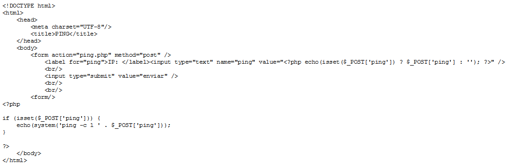
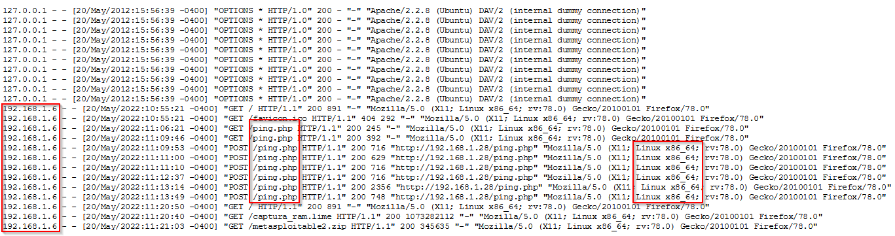
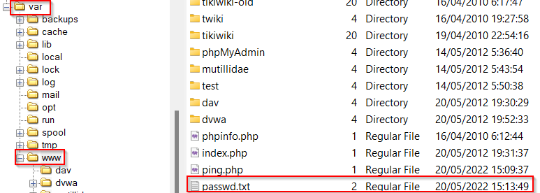

# Investigación - Israel Valderrama García

## Índice

1. [Identificar la vulnerabilidad en la aplicación web que fue explotada por el atacante](#identificar-la-vulnerabilidad-en-la-aplicación-web-que-fue-explotada-por-el-atacante)

2. [Determinar la IP, el cliente y el sistema operativo utilizado por el atacante durante el ataque.](#determinar-la-ip-el-cliente-y-el-sistema-operativo-utilizado-por-el-atacante-durante-el-ataque)

3. [Descubrir qué datos fueron exfiltrados del servidor comprometido.](#descubrir-qué-datos-fueron-exfiltrados-del-servidor-comprometido)

4. [Analizar por qué el archivo original no muestra actividad durante el incidente.](#analizar-por-qué-el-archivo-original-no-muestra-actividad-durante-el-incidente)

5. [Proponer soluciones para reparar la vulnerabilidad explotada.](#proponer-soluciones-para-reparar-la-vulnerabilidad-explotada)

## Identificar la vulnerabilidad en la aplicación web que fue explotada por el atacante

En la página web de Apache hemos identificado un archivo llamado "ping.php", el cual es vulnerable a inyecciones de comandos.

Para verificarlo, revisamos los registros de Apache y encontramos la inyección realizada, donde se extrajo un archivo passwd.txt, lo cual coincide con la fecha del último post.

ping.php

Actividad realizada con el ping.php

## Determinar la IP, el cliente y el sistema operativo utilizado por el atacante durante el ataque

Hemos revisado los logs y en los logs de `apache` hemos visto que hay un archivo que se llama `access.log` en la que nos da la información de la ip del atacante,  el cliente que utiliza y el sistema operativo

- IP: 192.168.1.6
- Cliente: Mozilla Firefox
- Sistema Operativo: Linux x86_64

## Descubrir qué datos fueron exfiltrados del servidor comprometido

Se genera un archivo `passwd.txt` en donde se guarda el contenido de `/etc/passwd`, este archivo se guarda en `/var/www/`

passwd.txt

## Analizar por qué el archivo original no muestra actividad durante el incidente

Porque el archivo lo `único` que se ha hecho ha sido hacerle un `cat` al archivo y lo han guardado en un `.txt`

## Proponer soluciones para reparar la vulnerabilidad explotada

Para reparar la vulnerabilidad lo que habría que hacer es sanitizar el código para que en la entrada no puedan pasar ningún payload. Otra de las mejoras que podríamos implementar es establecer contraseñas más segura.

Usar escáneres de vulnerabilidades para examinar si la aplicación detecta las vulnerabilidades que pueda tener, además deberíamos crear aislamiento para que el usuario no pueda ejecutar la aplicación para obtener información del sistema.
